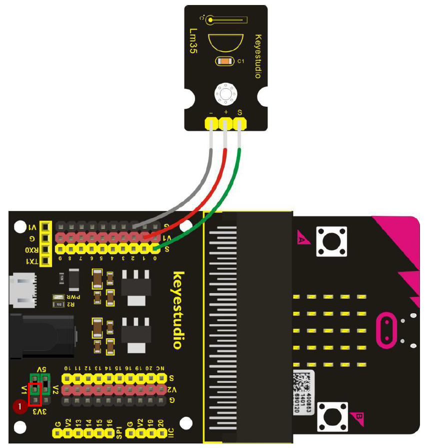

# Umgebungstemperatur - Howto

## Überblick
- Typ: LM35
- es handelt sich um einen analogen Sensor
- Die Werte sind linear und müssen in C° umgerechnet werden 

<!--- kurze Einführung -->

---

## Verkabelung 

<!--- Bild und Quellenangabe der Verkabelung -->

Abb.: [Handbuch KS0365 Sensor Kit](../../material/keystudio/KS0361(KS0365)%20Microbit%20V2.0%20Sensor%20Learning%20Kit.pdf) S. 187

---

## Code

<!--- code Beispiel: kann später von Github copy & pasted werden  -->

---

## Mögliche Probleme

<!--- Wenn Probleme bekannt sind bitte hier aufführen -->
- **Falsche Werte**
  -  Formel falsch
     -  check nochmal Abschnitt Code
  - Spannungsjumper falsch 
    - muss auf 3V3 sein bei V1 
      - siehe Markierung 1 (roter Kasten) im Abschnitt: Verkabelung
 ---

## Quellen 

<!--- Bitte alle Quellen angeben -->

Abb.: [Handbuch KS0365 Sensor Kit](../../material/keystudio/KS0361(KS0365)%20Microbit%20V2.0%20Sensor%20Learning%20Kit.pdf) S. 186 ff