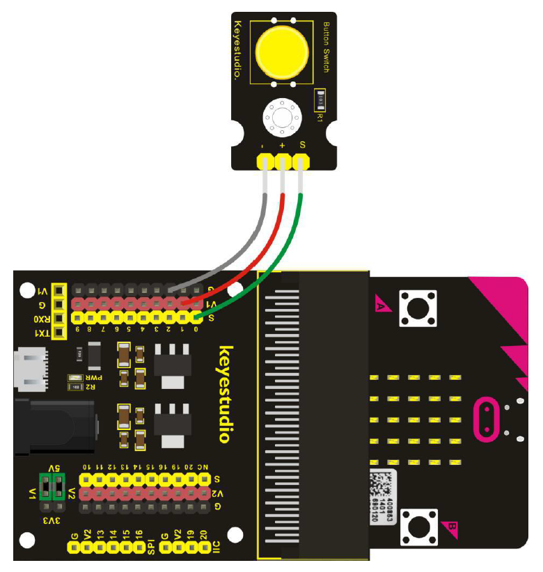

#  Digital Push Button - Howto

## Überblick

<!--- kurze Einführung -->
Mit dem Digital Button lassen sich leicht Kontrollstrukturen erstellen. 
Wir werden damit das Bild der Microbit-LEDs ändern. 

---

## Verkabelung 

<!--- Bild und Quellenangabe der Verkablung -->


Abb.: [Handbuch KS0365 Sensor Kit](../material/keystudio/KS0361(KS0365)%20Microbit%20V2.0%20Sensor%20Learning%20Kit.pdf) S. 128

---

## Code

<!--- code Beispiel: kann später von Github copy & pasted werden  -->

```python
from microbit import display, Image, pin0

while True:
    """
    hier ist auch pin0.read_digital() möglich, 
    dann ist der Wert aber 0 und 1 (Int) und nicht 
    True oder False
    """
    if pin0.is_touched():
        display.show(Image.HEART)
    else:
        display.show(Image.HEART_SMALL)
```

---


## Quellen 

<!--- Bitte alle Quellen angeben -->

Abb.: [Handbuch KS0365 Sensor Kit](../material/keystudio/KS0361(KS0365)%20Microbit%20V2.0%20Sensor%20Learning%20Kit.pdf) S. 128