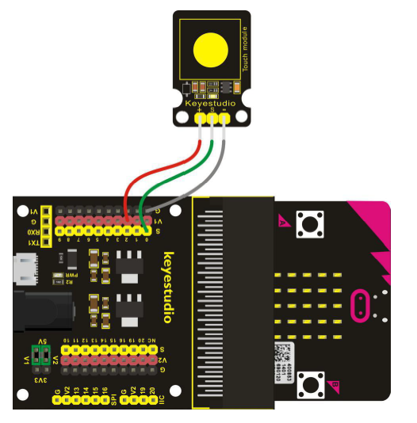

# Capacitive Touch Sensor - Howto

## Überblick

<!--- kurze Einführung -->

Ähnlich wie der [Digital Push Button](12_digtal-push-button.md) aber nicht als mechanische Lösung sondern Kapazitiv (touch)

---

## Verkabelung 

<!--- Bild und Quellenangabe der Verkablung -->



Abb.: [Handbuch KS0365 Sensor Kit](../material/keystudio/KS0361(KS0365)%20Microbit%20V2.0%20Sensor%20Learning%20Kit.pdf) S. 136

---

## Code

<!--- code Beispiel: kann später von Github copy & pasted werden  -->

```python
from microbit import display, Image, pin0

while True:
  
    if pin0.read_digital() == 1:
        display.show(Image.HEART)
    else:
        display.show(Image.HEART_SMALL)
```

---

## Mögliche Probleme

<!--- Wenn Probleme bekannt sind bitte hier aufführen -->

---

## Quellen 

<!--- Bitte alle Quellen angeben -->

Abb.: [Handbuch KS0365 Sensor Kit](../material/keystudio/KS0361(KS0365)%20Microbit%20V2.0%20Sensor%20Learning%20Kit.pdf) S. 136