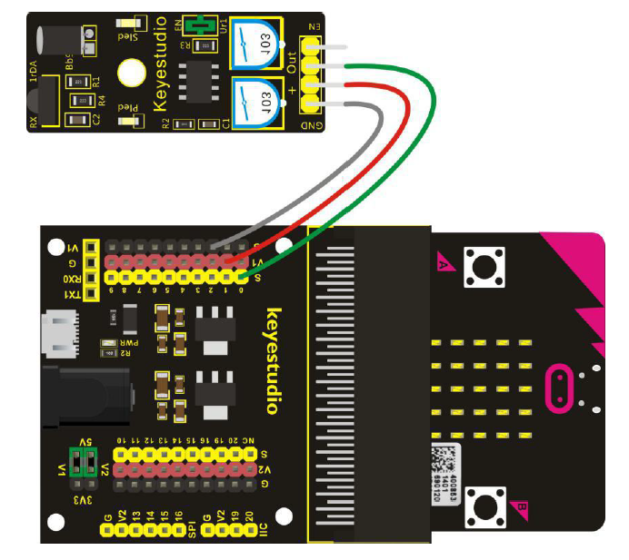

# Infrarot Hindernis Sensor - Howto

## Überblick

<!--- kurze Einführung -->
Der Infrarot Hindernis Sensor hilft uns dabei Gegenstände oder ähnliches zu erkennen. 
- Die effektivste Entfernung liegt zwischen 2 und 40cm
- Mit den Potentiometern kann die Empfindlichkeit eingestellt werden

---

## Verkabelung 

<!--- Bild und Quellenangabe der Verkablung -->



Abb.: [Handbuch KS0365 Sensor Kit](../material/keystudio/KS0361(KS0365)%20Microbit%20V2.0%20Sensor%20Learning%20Kit.pdf) S. 147

---

## Code

<!--- code Beispiel: kann später von Github copy & pasted werden  -->

```python
from microbit import pin0, sleep

while True:
    print(pin0.read_analog())
    sleep(500)
```

---

## Mögliche Probleme

<!--- Wenn Probleme bekannt sind bitte hier aufführen -->
- Infrarot Sender oder Empfänger verbogen
- mit Potentiometern die Empfindlichkeit einstellen
---

## Quellen 

<!--- Bitte alle Quellen angeben -->

Abb.: [Handbuch KS0365 Sensor Kit](../material/keystudio/KS0361(KS0365)%20Microbit%20V2.0%20Sensor%20Learning%20Kit.pdf) S. 147