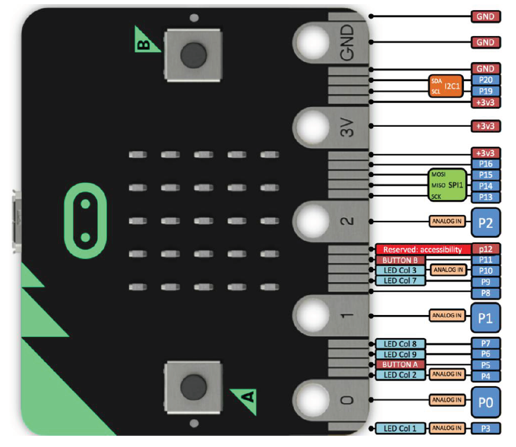
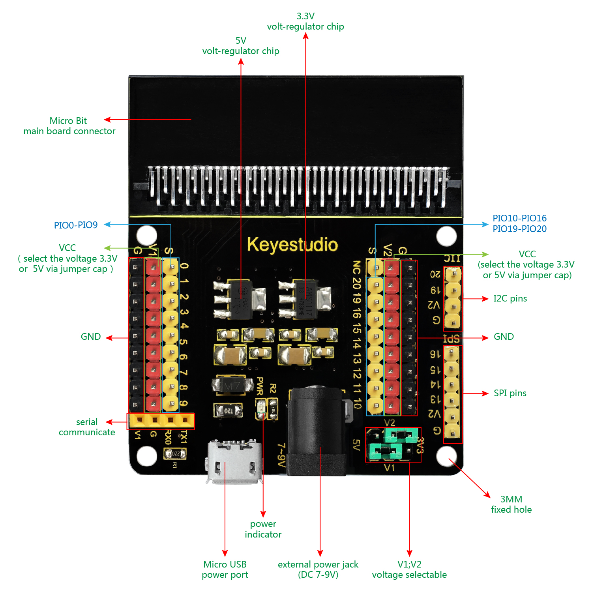
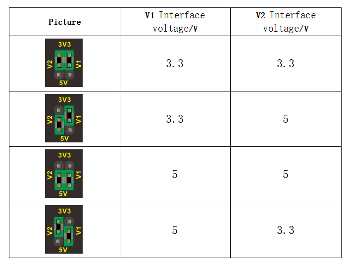

# Microbit Sensor Shield V2 - Howto

## Überblick

<!--- kurze Einführung -->

Das Sensor Shield eröffnet uns einen riesengroßen neuen Spielplatz. 
Es stehen uns bis zu 20 Anschlussmöglichkeiten (Pins) zur Verfügung
Sowie die unterschiedlichsten Kommunikationsprotokolle wie I2C (wird für Anbindung des [LCD Displays](lcd-display.md) verwendet) und SPI. 

## Hinweis für den Einsatz des Shields

vgl.: [Handbuch KS0365 Sensor Kit](../material/keystudio/KS0361(KS0365)%20Microbit%20V2.0%20Sensor%20Learning%20Kit.pdf) S. 11f 

---

## Anschlussmöglichkeiten des Microbit V2 

- **Kurzschlussgefahr** nicht den Microbit, Shield oder Sensor auf leitende Oberflächen (zB. Alufolie!!!) legen. Am besten auf Silikon. 
- **Gefahr des Durchbrennens**. Keine Geräte die viel Strom ziehen anschließen
- Am besten den Microbit über den USB port versorgen. Dies geht nur bei Sensoren bis 3V. Bei Sensoren die mit Werten von 5V arbeiten wird eine externe Versorgung benötigt --> Battrie Pack
- Die Pins **P3, P4, P6, P7, P10 werden für die LEDs des Microbits verwendet.** Sollten sie für andere Sachen (Sensoren) verwendet werden müssen die **LEDs deaktiviert werden**. Siehe [Verwendung des Buzzers](active-buzzer.md)
- **Niemals mit Metall-Gegenständen in Kontakt bringen --> Kurzschluss!!!**
  

<!--- Bild und Quellenangabe der Verkablung -->

Abb.: [Handbuch KS0365 Sensor Kit](../material/keystudio/KS0361(KS0365)%20Microbit%20V2.0%20Sensor%20Learning%20Kit.pdf) S. 10 

---

## Sensor Shield

Die 20 Pins sind jeweils in zwei Gruppen aufgeteilt. **Vorsicht**: V1/V2 steht hier nicht für die Microbit Version sondern für die Gruppen.
- V1: linke Seite - Pin0 bis Pin9
- V2: rechte Seite - P10 bis P20

Der Vorteil der Aufteilung liegt darin das für jede Gruppe definiert werden kann mit wieviel Volt sie versorgt wird (rechts unten im Bild: "V1;V2 voltage selectable")

Abb.: [Wiki: Ks0360 Keyestudio Sensor Shield V2 for BBC micro:bit](https://wiki.keyestudio.com/index.php/Ks0360_Keyestudio_Sensor_Shield_V2_for_BBC_micro:bit)

Abb.: [Wiki: Ks0360 Keyestudio Sensor Shield V2 for BBC micro:bit](https://wiki.keyestudio.com/index.php/Ks0360_Keyestudio_Sensor_Shield_V2_for_BBC_micro:bit)

--- 

## Quellen 

<!--- Bitte alle Quellen angeben -->

- Abb.: [Handbuch KS0365 Sensor Kit](../material/keystudio/KS0361(KS0365)%20Microbit%20V2.0%20Sensor%20Learning%20Kit.pdf) S. 10ff
- Abb.: [Wiki: Ks0360 Keyestudio Sensor Shield V2 for BBC micro:bit](https://wiki.keyestudio.com/index.php/Ks0360_Keyestudio_Sensor_Shield_V2_for_BBC_micro:bit)