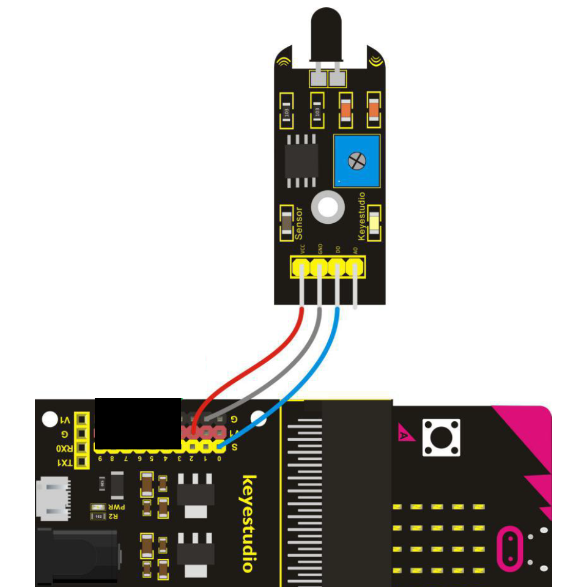

# Flammensensor - Howto

## Überblick

<!--- kurze Einführung -->
Der Flammensensor reagiert auf Licht- oder Feuerquellen mit einer Wellenlänge von 760nm bis 1100nm
Der Erfassungswinkel beträgt ca. 60 Grad

Den richtigen Punkt zu finden beim einstellen ist etwas schwierig. 
Eine gute Stelle ist an dem Punkt, wo die LED auf dem Sensor vom an in den aus Zustand übergeht


---

## Verkabelung 

<!--- Bild und Quellenangabe der Verkablung -->



Abb.: [Handbuch KS0365 Sensor Kit](../material/keystudio/KS0361(KS0365)%20Microbit%20V2.0%20Sensor%20Learning%20Kit.pdf) S. 153

---

## Code

<!--- code Beispiel: kann später von Github copy & pasted werden  -->

```python
from microbit import pin0, sleep

while True:
    print(pin0.read_analog())
    sleep(500)
```

---

## Mögliche Probleme

<!--- Wenn Probleme bekannt sind bitte hier aufführen -->

- mit Potentiometer die Empfindlichkeit einstellen
---

## Quellen 

<!--- Bitte alle Quellen angeben -->

Abb.: [Handbuch KS0365 Sensor Kit](../material/keystudio/KS0361(KS0365)%20Microbit%20V2.0%20Sensor%20Learning%20Kit.pdf) S. 153