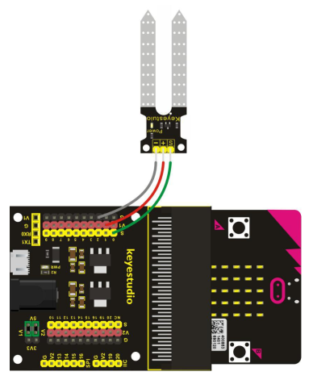

# LCD Display - Howto

## Überblick

<!--- kurze Einführung -->

---

## Verkabelung 

<!--- Bild und Quellenangabe der Verkablung -->



Abb.: [Handbuch KS0365 Sensor Kit](../material/keystudio/KS0361(KS0365)%20Microbit%20V2.0%20Sensor%20Learning%20Kit.pdf) S. 194

---

## Code

<!--- code Beispiel: kann später von Github copy & pasted werden  -->

```python
from microbit import pin0,sleep

while True:
    #Analoger Wert am pin0 (0-1023)
    raw = pin0.read_analog()
    #Tatsächlicher Sensorwert
    #Herstellerangabe: bei 5V max ca. 230mV->bei 3v3 max ca. 152mV
    #Messung in Wasser: bei 3v3 max ca. 160mV
    conv = raw/1023*300
    #Umrechnung in Prozent
    percentage = int(conv/160*100)
    #Ausgabe
    print("Soil humidity: "+str(percentage)+"%")
    sleep(2000)
```

---

## Mögliche Probleme

<!--- Wenn Probleme bekannt sind bitte hier aufführen -->

Keine bekannt.

---

## Quellen 

<!--- Bitte alle Quellen angeben -->

[Handbuch KS0365 Sensor Kit](../material/keystudio/KS0361(KS0365)%20Microbit%20V2.0%20Sensor%20Learning%20Kit.pdf) S. 193ff
