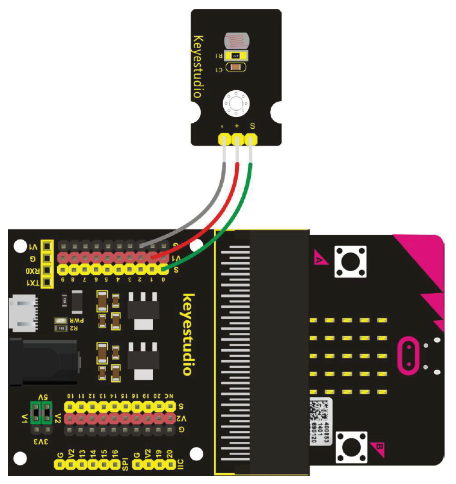

# Fotozellensensor - Howto

## Überblick

<!--- kurze Einführung -->

Manche Straßenlaternen schalten sich selbst bei Dämmerung ein und am Morgen wieder aus. Diese Schaltungen werden mit einem Fotozellensensor umgesetzt. Der Sensor misst die Helligkeit seiner Umgebung, und gibt diese als analogen Wert wieder. 

Je höher der Wert desto heller ist das Licht in der Umgebung


---

## Verkabelung 

<!--- Bild und Quellenangabe der Verkablung -->



Abb.: [Handbuch KS0365 Sensor Kit](../material/keystudio/KS0361(KS0365)%20Microbit%20V2.0%20Sensor%20Learning%20Kit.pdf) S. 168

---

## Code

<!--- code Beispiel: kann später von Github copy & pasted werden  -->

```python
from microbit import display, pin0, sleep

display.off()

while True:
    # gibt den Wert im Seriellen Monitor aus
    print(pin0.read_analog())
    sleep(500) # Werte werden ruhiger 
```

---


## Quellen 

<!--- Bitte alle Quellen angeben -->

Abb.: [Handbuch KS0365 Sensor Kit](../material/keystudio/KS0361(KS0365)%20Microbit%20V2.0%20Sensor%20Learning%20Kit.pdf) S. 168