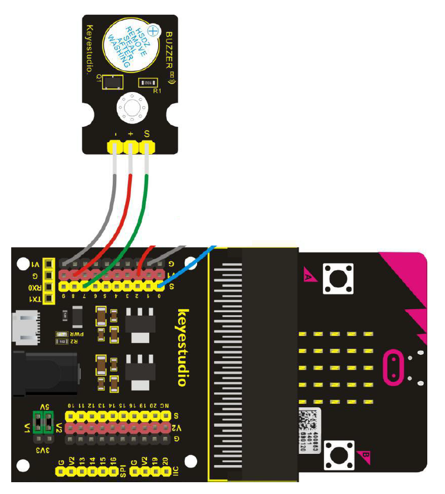

# Aktiv Buzzer Modul - Howto

## Überblick

<!--- kurze Einführung -->
Der Buzzer selber ist kein Sensor sondern ein Gerät mit dem Töne erzeugt werden können. 

**Wichtig**: bitte während der Übung **nicht die Papier-Folie entfernen** da der Buzzer sonst unangenehm Laut ist

---

## Verkabelung 

<!--- Bild und Quellenangabe der Verkablung -->



Abb.: [Handbuch KS0365 Sensor Kit](../material/keystudio/KS0361(KS0365)%20Microbit%20V2.0%20Sensor%20Learning%20Kit.pdf) S. 153

---

## Code

<!--- code Beispiel: kann später von Github copy & pasted werden  -->

```python
from microbit import button_a, pin7, display

""" 
Wir verbinden den buzzer mit p7 in diesem bsp. natürlich kann er auch mit 
jedem anderen pin verbunden werden. 

Beachten p3, p4, p6, p7, p10 sind im Display mode,
das bedeudet, wenn wir diese Pins verwenden müssen wir das Display vom 
Microbit deaktivieren, da wir sonst möglicherweise falsche Werte erhalten 
und/oder das Display seltsame Dinge anzeigt. 
Siehe Handbuch S. 11:  
(4) Notes for the application of Micro:bit main board V2.0 - Abs. D
"""
display.off()
pin7.write_digital(0) # sichergehen das der buzzer aus ist beim start

while True:
    # solang button a gedrückt wird...
    if button_a.is_pressed():
        # ...hören wir ein Signal 
        pin7.write_digital(1)

    # ...button a wird losgelassen (ist nicht gedrückt)
    else:
        #das Signal verstummt
        pin7.write_digital(0)
```

---

## Mögliche Probleme

<!--- Wenn Probleme bekannt sind bitte hier aufführen -->

Verhält sich seltsam, Display zeigt seltsame Sachen an
- wurde einer der folgenden Pins verwendet? 
  - p3, p4, p6, p7, p10
    - Wenn ja, wurde das Display des Microbits (LEDs) vorher deaktiviert? 
      - Wenn nein, pins sind noch im Display Modus (siehe Bemerkung im Code-Beispiel)

---

## Quellen 

<!--- Bitte alle Quellen angeben -->

Abb.: [Handbuch KS0365 Sensor Kit](../material/keystudio/KS0361(KS0365)%20Microbit%20V2.0%20Sensor%20Learning%20Kit.pdf) S. 153